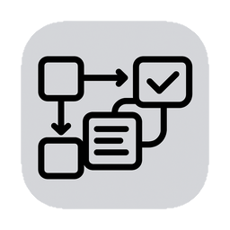

<div align="center">



# ArchiComm
### A desktop companion for studying system design

[](https://tauri.app)
[](https://react.dev)
[](https://www.typescriptlang.org/)

Learn, practice, and teach system design through guided scenarios, interactive diagrams, and repeatable exercises.

[Get Started](#quick-start) • [Why ArchiComm](#why-archicomm) • [Study Flow](#study-flow) • [Modules](#study-modules) • [AI Review](#optional-ai-review)

</div>

---

## Why ArchiComm

ArchiComm reframes the app as a learning tool focused on system design fundamentals and interview practice.

- Study by doing: work through realistic scenarios end-to-end.
- Reason about trade-offs: latency vs. throughput, consistency vs. availability, cost vs. performance.
- Build a reusable toolkit: patterns, checklists, estimations, and ADRs you can export.
- Teach and coach: run time‑boxed interview sessions with rubrics and hints.

See also: src/docs/SystemDesignPractice.md

---

## Quick Start

```bash
# Clone and launch the desktop app
git clone https://github.com/acailic/archicomm.git
cd archicomm
npm install
npm run dev   # or: npm start
```

Build binaries: `npm run build` (Tauri bundles for your OS).

---

## Study Flow

- Define requirements: functional scope, SLAs/SLOs, constraints, traffic assumptions.
- Estimate: back‑of‑the‑envelope throughput, storage, QPS, fan‑out, costs.
- Design: place components on the canvas; connect data flows and failure domains.
- Explore trade‑offs: toggle replication, sharding, consistency, cache policies, queues.
- Validate: run checklists and rubrics; capture risks and mitigation strategies.
- Document: export diagram (SVG/PNG), notes/ADR (Markdown), and assumptions.

---

## Key Features for Studying

- **Voice Recording & Transcription**: Record audio explanations of your system designs with manual transcript entry and planned automatic speech-to-text conversion.
- Scenario templates: classic problems (URL shortener, news feed, chat, ride‑hailing, file storage).
- Patterns library: load balancing, caching, sharding, CQRS, pub/sub, rate limiting.
- Trade‑off explorer: consistency levels, replication factors, partitioning schemes, backpressure.
- Estimation helpers: latency budgets, p50/p95, queue depth, storage growth, cost rough‑order.
- Interview mode: time‑boxed session, hints, rubric, and exportable scorecard.
- Exports: diagrams (SVG/PNG), notes (Markdown), and ADR templates.

---

## Audio Features

ArchiComm includes powerful audio recording capabilities to help you practice explaining your system designs verbally - a crucial skill for technical interviews and design reviews.

### Current Features
- **Audio Recording**: Record your design explanations with built-in microphone support
- **Manual Transcription**: Enter text transcripts alongside your audio recordings
- **Playback Controls**: Review your recorded explanations with integrated audio playback
- **Duration Tracking**: Monitor recording time with real-time duration display
- **Word Count Analysis**: Track transcript length and speaking pace metrics

### Planned Enhancements
- **Automatic Speech-to-Text**: Convert audio recordings to text automatically using cloud speech services
- **Voice Command Recognition**: Navigate and control the app using voice commands
- **Audio Analysis**: Get feedback on speaking pace, clarity, and technical depth
- **Offline Transcription**: Process audio locally without requiring internet connectivity

See [TODO.md](TODO.md) for the complete roadmap of planned audio and speech features.

---

## Study Modules

ArchiComm loads “Tasks” (study modules) that define prompts, acceptance criteria, hints, and assets. You can add your own tasks or use built‑ins.

- Structure and examples: src/docs/SystemDesignPractice.md
- Create a task: add a `task.json` under `src/lib/tasks/plugins/<your-task>/` and export it from `src/lib/tasks/index.ts`.
- Optional assets: diagrams, seed data, or reference links.

Example scenarios to include:
- URL shortener at scale
- Twitter/Instagram news feed
- Real‑time chat and presence
- Distributed cache and invalidation
- Background jobs and retries
- Ride‑hailing dispatch

---

## Optional AI Review

You can request rubric‑based feedback using a local Tauri command that proxies to your model provider (keeps keys out of the UI). Setup steps and sample code are documented in src/docs/SystemDesignPractice.md.

- Configure `OPENAI_API_KEY` (or swap in another provider).
- Invoke `ai_review` from the UI; receive summary, strengths, risks, and a score.

---

## Shortcuts

- Command palette: `Ctrl/Cmd + K`
- Add/Connect mode: `A` / `C`
- Zoom to fit: `Ctrl/Cmd + 0`
- Duplicate: `Ctrl/Cmd + D`
- Undo/Redo: `Ctrl/Cmd + Z` / `Ctrl/Cmd + Shift + Z`

Press `?` in the app for the full list.

---

## Tech Stack

- Desktop shell: Tauri (Rust)
- UI: React + TypeScript, Radix UI, Tailwind
- Canvas and interactions: custom canvas engine, Motion/Framer animations

---

## Contributing

We welcome improvements to modules, patterns, checklists, and study flows.

```bash
git clone https://github.com/acailic/archicomm.git
cd archicomm
npm install
npm run dev
```

Ideas that help learners most:
- New study modules with clear acceptance criteria and hints
- Trade‑off explorers (e.g., sharding vs. hashing strategies)
- Estimation worksheets and rubric improvements
- Better exports (ADR templates, interview scorecards)
- Audio and speech-to-text enhancements (see [TODO.md](TODO.md))


---

## 📜 **Complete Shortcuts Reference**

<details>
<summary><b>⌨️ All Keyboard Shortcuts (Click to expand)</b></summary>

### **🎨 Canvas Operations**
| Action | Windows/Linux | macOS | Description |
|:---|:---:|:---:|:---|
| Pan Canvas | `Space + Drag` | `Space + Drag` | Move around the canvas |
| Zoom In/Out | `Ctrl + +/-` | `Cmd + +/-` | Zoom canvas view |
| Fit to Screen | `Ctrl + 0` | `Cmd + 0` | Fit all content to view |
| Actual Size | `Ctrl + 1` | `Cmd + 1` | Reset to 100% zoom |
| Full Screen | `F11` | `Cmd + F` | Toggle fullscreen mode |

### **🧩 Component Operations**  
| Action | Windows/Linux | macOS | Description |
|:---|:---:|:---:|:---|
| Add Component | `Space` | `Space` | Open component palette |
| Quick Search | `Ctrl + K` | `Cmd + K` | Search components/actions |
| Duplicate | `Ctrl + D` | `Cmd + D` | Duplicate selected items |
| Group Selection | `Ctrl + G` | `Cmd + G` | Group selected components |
| Ungroup | `Ctrl + Shift + G` | `Cmd + Shift + G` | Ungroup components |

### **🔗 Connection Tools**
| Action | Windows/Linux | macOS | Description |
|:---|:---:|:---:|:---|
| Connection Mode | `C` | `C` | Enter connection drawing mode |
| Quick Connect | `Ctrl + Click` | `Cmd + Click` | Connect two components |
| Delete Connection | `Del` | `Del` | Remove selected connection |
| Edit Connection | `Double Click` | `Double Click` | Edit connection properties |

### **📝 Documentation & Comments**
| Action | Windows/Linux | macOS | Description |
|:---|:---:|:---:|:---|
| Add Comment | `Ctrl + /` | `Cmd + /` | Add comment/annotation |
| Quick Note | `N` | `N` | Add sticky note |
| Voice Note | `V` | `V` | Record voice annotation |
| Export Comments | `Ctrl + E` | `Cmd + E` | Export all comments |

### **💾 File Operations**
| Action | Windows/Linux | macOS | Description |
|:---|:---:|:---:|:---|
| New Project | `Ctrl + N` | `Cmd + N` | Create new project |
| Open Project | `Ctrl + O` | `Cmd + O` | Open existing project |
| Save Project | `Ctrl + S` | `Cmd + S` | Save current project |
| Save As | `Ctrl + Shift + S` | `Cmd + Shift + S` | Save with new name |
| Export | `Ctrl + E` | `Cmd + E` | Export project |

### **🎯 Selection & Editing**
| Action | Windows/Linux | macOS | Description |
|:---|:---:|:---:|:---|
| Select All | `Ctrl + A` | `Cmd + A` | Select all components |
| Multi-Select | `Shift + Click` | `Shift + Click` | Add to selection |
| Box Select | `Drag` | `Drag` | Select with rectangle |
| Lasso Select | `L + Drag` | `L + Drag` | Free-form selection |
| Invert Selection | `Ctrl + I` | `Cmd + I` | Invert current selection |

### **↩️ History & Undo**
| Action | Windows/Linux | macOS | Description |
|:---|:---:|:---:|:---|
| Undo | `Ctrl + Z` | `Cmd + Z` | Undo last action |
| Redo | `Ctrl + Y` | `Cmd + Shift + Z` | Redo last undone action |
| History Panel | `Ctrl + H` | `Cmd + H` | Show history timeline |

### **🎨 View & Layout**
| Action | Windows/Linux | macOS | Description |
|:---|:---:|:---:|:---|
| Grid Toggle | `Ctrl + '` | `Cmd + '` | Show/hide grid |
| Snap Toggle | `Ctrl + ;` | `Cmd + ;` | Toggle snapping |
| Rulers | `Ctrl + R` | `Cmd + R` | Show/hide rulers |
| Guides | `Ctrl + Shift + ;` | `Cmd + Shift + ;` | Show/hide guides |
| Layers Panel | `F7` | `F7` | Toggle layers panel |

### **🔍 Navigation & Search**
| Action | Windows/Linux | macOS | Description |
|:---|:---:|:---:|:---|
| Find Component | `Ctrl + F` | `Cmd + F` | Find specific component |
| Go to Component | `Ctrl + G` | `Cmd + G` | Navigate to component |
| Next Match | `F3` | `Cmd + G` | Go to next search result |
| Previous Match | `Shift + F3` | `Cmd + Shift + G` | Go to previous result |

### **⚙️ Tools & Modes**
| Action | Windows/Linux | macOS | Description |
|:---|:---:|:---:|:---|
| Hand Tool | `H` | `H` | Pan/navigate mode |
| Select Tool | `V` | `V` | Default selection tool |
| Text Tool | `T` | `T` | Add text labels |
| Shape Tool | `U` | `U` | Draw basic shapes |
| Measure Tool | `M` | `M` | Measure distances |

### **🎵 Audio & Recording**
| Action | Windows/Linux | macOS | Description |
|:---|:---:|:---:|:---|
| Start Recording | `R` | `R` | Begin audio recording |
| Stop Recording | `Esc` | `Esc` | Stop audio recording |
| Play/Pause | `Spacebar` | `Spacebar` | Play/pause audio |
| Quick Voice Note | `Shift + V` | `Shift + V` | Record quick voice note |

### **🚀 Performance & System**
| Action | Windows/Linux | macOS | Description |
|:---|:---:|:---:|:---|
| Performance Monitor | `Ctrl + Shift + P` | `Cmd + Shift + P` | Show performance stats |
| Memory Usage | `Ctrl + Shift + M` | `Cmd + Shift + M` | Display memory usage |
| Developer Tools | `F12` | `Cmd + Option + I` | Open developer console |
| Reload App | `Ctrl + R` | `Cmd + R` | Reload application |
| Hard Refresh | `Ctrl + Shift + R` | `Cmd + Shift + R` | Clear cache and reload |

</details>

---

## 📄 **License**

This project is licensed under the MIT License - see the [LICENSE](LICENSE) file for details.

---

<div align="center">

**Made with ❤️ by the ArchiComm Team**

*Empowering architects to design the future, one component at a time.*

⭐ **Star us on GitHub** • 🐦 **Follow on Twitter** • 💬 **Join Discord**

</div>
