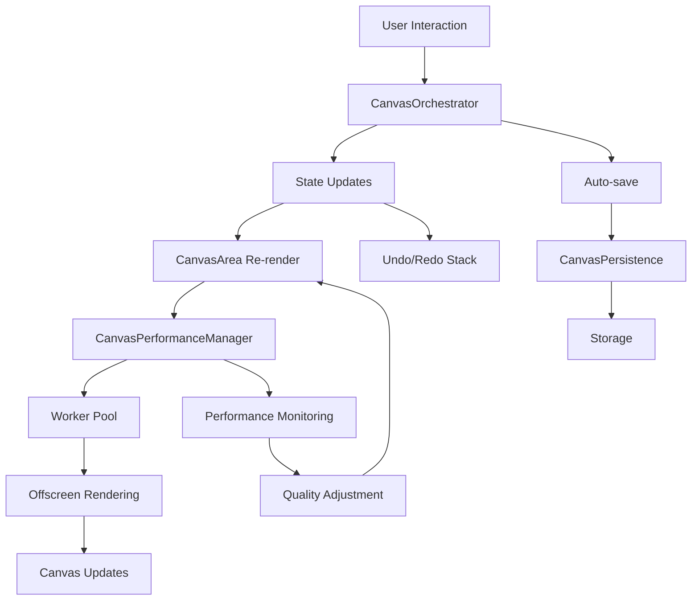

# Canvas Architecture Documentation

## Overview

ArchiComm's canvas system provides a high-performance, scalable architecture for rendering and managing complex architectural diagrams. The system is built with React, TypeScript, and modern web technologies to deliver smooth user experiences even with large, complex diagrams.

## Core Architecture

### Component Hierarchy

```
DesignCanvas (Root Container)
├── CanvasErrorBoundary (Error Recovery)
├── CanvasArea (Interaction Layer)
│   ├── CanvasComponent (Individual Nodes)
│   ├── ConnectionRenderer (Relationships)
│   └── GridLayer (Visual Grid)
├── CanvasToolbar (Controls)
└── PropertiesPanel (Configuration)
```

### Data Flow



## Core Components

### CanvasOrchestrator

**Purpose:** Centralized state management and coordination for all canvas operations.

**Key Features:**
- Unified state management using React Context
- Integrated undo/redo functionality with `useUndoRedo`
- Auto-save capabilities with `useAutoSave`
- Batch operations for performance
- State validation and error handling

**Usage:**
```typescript
const {
  components,
  connections,
  addComponent,
  undo,
  redo,
  canUndo,
  canRedo,
  isSaving
} = useCanvas();
```

### CanvasPerformanceManager

**Purpose:** Comprehensive performance monitoring and optimization.

**Key Features:**
- Adaptive quality adjustment based on performance metrics
- Web Worker management for offscreen rendering
- Memory usage monitoring and optimization
- System capability detection
- Performance budgets and recommendations

**Architecture:**
```typescript
interface CanvasPerformanceConfig {
  mode: 'quality' | 'balanced' | 'performance';
  enableWorkers: boolean;
  enableOffscreenCanvas: boolean;
  maxMemoryUsage: number;
  targetFPS: number;
  adaptiveQuality: boolean;
}
```

### Canvas Worker System

**Purpose:** Offscreen rendering using Web Workers for improved performance.

**Message Protocol:**
```typescript
// Initialization
{ type: 'init', canvas?: OffscreenCanvas }

// Rendering
{ 
  type: 'render', 
  data: {
    components: ComponentData[],
    connections: ConnectionData[],
    viewport: ViewportData,
    qualityLevel: number
  }
}

// Termination
{ type: 'terminate' }
```

**Fallback Strategy:**
1. Try OffscreenCanvas with Web Workers
2. Fall back to Web Workers without OffscreenCanvas
3. Fall back to main thread rendering
4. Reduce quality settings if performance suffers

### CanvasPersistence

**Purpose:** Robust data persistence with error handling and recovery.

**Key Features:**
- Automatic compression for large datasets
- Data validation before save/load
- Backup system with corruption detection
- Incremental saves to reduce latency
- Cross-platform storage (Tauri/Web)

**Error Recovery:**
- Automatic backup creation before saves
- Checksum validation for data integrity
- Recovery from backup on corruption detection
- Cleanup of old/corrupted data

### CanvasErrorBoundary

**Purpose:** Intelligent error recovery for canvas-specific failures.

**Error Classification:**
- **WebGL Errors:** Context loss, GPU issues
- **Worker Errors:** Failed worker creation/communication
- **Memory Errors:** Out of memory, quota exceeded
- **Render Errors:** Canvas rendering failures

**Recovery Strategies:**
- WebGL → Fallback to 2D canvas, disable workers
- Worker → Terminate workers, main thread rendering
- Memory → Clear caches, reduce quality, garbage collect
- Render → Reset canvas state, retry operation

## Performance Optimizations

### Adaptive Quality System

The system automatically adjusts rendering quality based on performance:

```typescript
interface QualityLevels {
  high: 1.0;    // Full antialiasing, gradients, shadows
  medium: 0.7;  // Basic antialiasing, simple gradients
  low: 0.4;     // No antialiasing, flat colors
  minimal: 0.2; // Essential rendering only
}
```

### Viewport Culling

Components outside the visible viewport are not rendered:

```typescript
const isInViewport = (component: DesignComponent, viewport: Viewport) => {
  return component.x < viewport.x + viewport.width &&
         component.x + component.width > viewport.x &&
         component.y < viewport.y + viewport.height &&
         component.y + component.height > viewport.y;
};
```

### Level-of-Detail (LOD) Rendering

Rendering detail adjusts based on zoom level and component size:

- **High Detail:** Labels, shadows, gradients, rounded corners
- **Medium Detail:** Basic shapes, essential labels
- **Low Detail:** Simple rectangles, no text

### Worker Pool Management

Intelligent worker allocation based on system capabilities:

```typescript
const workerCapacity = Math.max(1, navigator.hardwareConcurrency - 1);
```

## Integration Patterns

### useCanvasIntegration Hook

Provides complete canvas integration:

```typescript
const { state, actions, orchestrator } = useCanvasIntegration({
  canvasId: 'main-canvas',
  enableAutoSave: true,
  enablePerformanceMonitoring: true,
  enableErrorRecovery: true
});
```

### Error Boundary Usage

Wrap canvas components for robust error handling:

```tsx
<CanvasErrorBoundary
  enableRecovery={true}
  maxRetries={3}
  performanceManager={performanceManager}
>
  <CanvasArea />
</CanvasErrorBoundary>
```

## Testing Strategy

### Unit Tests

- Component rendering
- State management
- Worker communication
- Performance calculations

### Integration Tests

- Canvas orchestrator workflows
- Performance manager integration
- Error recovery scenarios
- Persistence operations

### E2E Tests

- Large diagram rendering
- Performance under load
- Error recovery flows
- Cross-browser compatibility

## Performance Monitoring

### Key Metrics

- **FPS:** Target 60fps, acceptable >30fps
- **Render Time:** Target <16ms per frame
- **Memory Usage:** Monitor heap size, detect leaks
- **Worker Health:** Track active workers, failures

### Performance Budgets

```typescript
const performanceBudgets = {
  canvas2d: {
    renderTime: 8,      // ms
    memoryUsage: 200,   // MB
    fpsThreshold: 55,
    complexityThreshold: 500
  },
  webgl: {
    renderTime: 4,      // ms
    memoryUsage: 300,   // MB
    fpsThreshold: 58,
    complexityThreshold: 2000
  }
};
```

## Troubleshooting

### Common Issues

**WebGL Context Loss:**
- Symptoms: Black canvas, "context lost" errors
- Recovery: Automatic fallback to 2D canvas
- Prevention: Monitor GPU memory usage

**Worker Failures:**
- Symptoms: "Failed to create worker" errors
- Recovery: Disable workers, use main thread
- Prevention: Feature detection, graceful degradation

**Memory Leaks:**
- Symptoms: Increasing memory usage over time
- Recovery: Force garbage collection, clear caches
- Prevention: Proper cleanup, object pooling

**Performance Degradation:**
- Symptoms: Low FPS, high render times
- Recovery: Automatic quality reduction
- Prevention: Performance monitoring, budgets

### Debugging Tools

**Performance Profiler:**
```typescript
const metrics = performanceManager.exportPerformanceData();
console.log('Performance Report:', metrics);
```

**Error Reporting:**
```typescript
// Error details automatically copied to clipboard
errorBoundary.handleReportBug();
```

**Quality Level Override:**
```typescript
performanceManager.setAdaptiveQuality(false);
// Force specific quality level for testing
```

## Best Practices

### Component Design

1. **Minimize Re-renders:** Use React.memo and useCallback
2. **Batch Operations:** Group related updates
3. **Error Boundaries:** Wrap critical sections
4. **Performance Monitoring:** Track key metrics

### State Management

1. **Centralized State:** Use CanvasOrchestrator for all canvas state
2. **Immutable Updates:** Always create new state objects
3. **Validation:** Validate state before applying changes
4. **Undo/Redo:** Use built-in history management

### Performance

1. **Adaptive Quality:** Let the system adjust automatically
2. **Worker Usage:** Enable for complex operations
3. **Viewport Culling:** Only render visible components
4. **Memory Management:** Monitor and cleanup resources

### Error Handling

1. **Graceful Degradation:** Always provide fallbacks
2. **User Communication:** Clear error messages and recovery options
3. **Logging:** Comprehensive error reporting
4. **Recovery:** Automatic and manual recovery options

## Future Enhancements

### Planned Features

1. **WebGL2 Support:** Enhanced GPU acceleration
2. **SharedArrayBuffer:** Worker-to-worker communication
3. **WebAssembly:** High-performance calculations
4. **Virtual Canvas:** Infinite scroll support
5. **Real-time Collaboration:** Multi-user editing

### Performance Improvements

1. **GPU-based Physics:** Collision detection on GPU
2. **Instanced Rendering:** Efficient duplicate rendering
3. **Texture Atlasing:** Reduced draw calls
4. **Spatial Indexing:** Faster viewport culling

## API Reference

### CanvasOrchestrator Context

```typescript
interface CanvasState {
  components: DesignComponent[];
  connections: Connection[];
  layers: Layer[];
  selectedComponentId: string | null;
  selectedComponentIds: string[];
  activeLayerId: string | null;
  activeTool: ToolType;
  gridConfig: GridConfig;
  canUndo: boolean;
  canRedo: boolean;
  lastSavedAt: number | null;
  isSaving: boolean;
  saveStatus: 'idle' | 'saving' | 'saved' | 'error';
}

interface CanvasActions {
  // Basic operations
  addComponent: (component: ComponentInput) => string;
  moveComponent: (id: string, x: number, y: number) => void;
  updateComponent: (id: string, patch: Partial<DesignComponent>) => void;
  deleteComponent: (id: string) => void;
  
  // Selection
  selectComponent: (id: string | null, multi?: boolean) => void;
  clearSelection: () => void;
  
  // Connections
  addConnection: (connection: ConnectionInput) => string;
  deleteConnection: (id: string) => void;
  
  // History
  undo: () => void;
  redo: () => void;
  clearHistory: () => void;
  
  // Batch operations
  addMultipleComponents: (components: ComponentInput[]) => string[];
  moveMultipleComponents: (ids: string[], deltaX: number, deltaY: number) => void;
  duplicateComponent: (id: string) => string | null;
  
  // Persistence
  forceSave: () => void;
  exportJSON: () => Promise<string>;
  exportPNG: (element: HTMLElement) => Promise<string>;
}
```

### Performance Manager API

```typescript
class CanvasPerformanceManager {
  // System management
  registerCanvasSystem(id: string, canvas: HTMLCanvasElement, type?: CanvasType): CanvasOptimizer;
  unregisterCanvasSystem(id: string): void;
  
  // Configuration
  updateConfig(updates: Partial<CanvasPerformanceConfig>): void;
  setPerformanceBudget(id: string, budget: Partial<PerformanceBudget>): void;
  
  // Monitoring
  getPerformanceMetrics(): Map<string, CanvasSystemMetrics>;
  getAggregatedMetrics(): AggregatedMetrics;
  getRecommendations(): PerformanceRecommendation[];
  
  // Control
  optimizePerformance(): void;
  setAdaptiveQuality(enabled: boolean): void;
  getCurrentQualityLevel(): number;
  
  // Worker management
  renderToWorker(id: string, renderData: RenderData): void;
  
  // Utilities
  getSystemCapabilities(): SystemCapabilities;
  exportPerformanceData(): PerformanceExport;
  cleanup(): void;
}
```

This architecture provides a robust, scalable foundation for complex canvas operations while maintaining excellent performance and user experience.