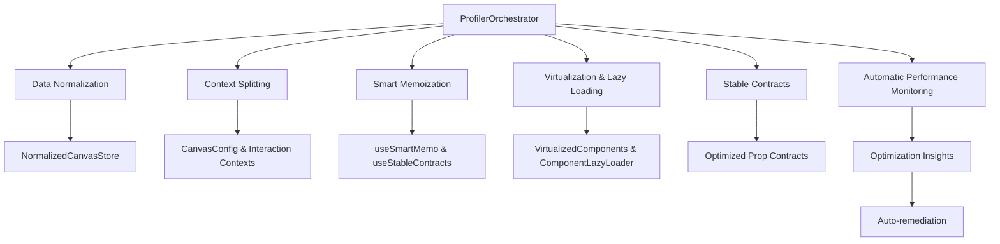

# Performance Optimization Implementation Guide

## Overview

This document provides a comprehensive guide to the performance optimization infrastructure implemented in ArchiComm. The optimization strategy follows a data-driven approach to identify and resolve rendering bottlenecks, particularly in canvas-heavy operations.

## Architecture Overview

The performance optimization system consists of six key pillars:



## 1. Profiling Infrastructure

### ProfilerOrchestrator

**Location**: `src/lib/performance/ProfilerOrchestrator.ts`

The ProfilerOrchestrator provides centralized coordination of all profiling activities:

```typescript
// Start an automatic profiling session
const profiler = ProfilerOrchestrator.getInstance();
profiler.startSession({
  name: 'canvas-heavy-operation',
  duration: 30000,
  componentsToTrack: ['CanvasController', 'DesignCanvas'],
  triggerConditions: {
    renderThreshold: 50, // ms
    updateDepthThreshold: 5,
    memoryThreshold: 100 * 1024 * 1024 // 100MB
  },
  autoOptimize: true
});
```

**Key Features**:
- Automatic profiling session management
- Integration with React Profiler API
- Performance metrics collection and analysis
- Optimization insight generation
- Component-specific tracking

### Integration Points

**Main.tsx Integration**:
```typescript
// Automatic app initialization profiling
profilerOrchestrator.startSession({
  name: 'app-initialization',
  duration: 30000,
  componentsToTrack: [
    'AppContainer', 'DesignCanvas', 'CanvasController',
    'AssignmentPanel', 'PropertiesPanel', 'StatusBar'
  ],
  autoOptimize: true
});
```

## 2. Data Normalization Layer

### Problem Addressed
Canvas operations frequently involved expensive array operations (`.find()`, `.filter()`, `.map()`) that scaled poorly with component count.

### Solution: Entity-Based Data Structure

**Location**: `src/stores/normalized/`

```typescript
// Before: Array-based (O(n) lookups)
const component = components.find(c => c.id === targetId);

// After: Normalized lookup (O(1) lookups)
const component = normalizedData.components.byId[targetId];
```

### Implementation

**CanvasDataNormalizer** (`src/stores/normalized/CanvasDataNormalizer.ts`):
```typescript
export interface NormalizedComponents {
  byId: Record<string, DesignComponent>;
  allIds: string[];
  byType: Record<string, string[]>;
  byLayer: Record<string, string[]>;
}

export class CanvasDataNormalizer {
  static normalizeComponents(components: DesignComponent[]): NormalizedComponents {
    const byId: Record<string, DesignComponent> = {};
    const allIds: string[] = [];
    const byType: Record<string, string[]> = {};
    const byLayer: Record<string, string[]> = {};

    for (const component of components) {
      byId[component.id] = component;
      allIds.push(component.id);

      // Group by type for efficient filtering
      if (!byType[component.type]) byType[component.type] = [];
      byType[component.type].push(component.id);

      // Group by layer for rendering optimization
      const layer = component.layer || 'default';
      if (!byLayer[layer]) byLayer[layer] = [];
      byLayer[layer].push(component.id);
    }

    return { byId, allIds, byType, byLayer };
  }
}
```

**NormalizedCanvasStore** (`src/stores/normalized/NormalizedCanvasStore.ts`):
```typescript
// Entity-based updates that prevent full array replacements
const normalizedCanvasActions: NormalizedCanvasActions = {
  updateComponent(componentId: string, updates: Partial<DesignComponent>) {
    commitNormalizedChange('updateComponent', draft => {
      draft.normalizedData.components = NormalizedDataUpdater.updateComponent(
        draft.normalizedData.components, componentId, updates
      );
    });
  }
};
```

### Migration Strategy

**Feature Flag Implementation** (`src/stores/canvasStore.ts`):
```typescript
// Feature flag for gradual rollout
const USE_NORMALIZED_DATA = import.meta.env.VITE_USE_NORMALIZED_STORE === 'true' || import.meta.env.DEV;

// Automatic sync between normalized and array data
if (state._useNormalizedData) {
  syncNormalizedData(state);
}
```

## 3. Context Splitting Strategy

### Problem Addressed
Single large context caused unnecessary re-renders when unrelated state changed.

### Solution: Separated Concerns

**CanvasConfigContext** (`src/packages/canvas/contexts/CanvasConfigContext.tsx`):
- Immutable configuration (theme, grid, tools)
- Changes infrequently
- Prevents unnecessary re-renders of configuration-dependent components

**CanvasInteractionContext** (`src/packages/canvas/contexts/CanvasInteractionContext.tsx`):
- High-frequency interaction state (drag, hover, selection)
- Isolated from configuration changes
- Optimized for rapid updates

```typescript
// Configuration context (stable)
const canvasConfig = useCanvasConfig();

// Interaction context (frequently changing)
const { drag, selection, hover } = useCanvasInteraction();
```

## 4. Smart Memoization System

### useSmartMemo Hook

**Location**: `src/shared/hooks/performance/useSmartMemo.ts`

Intelligent memoization that adapts to component behavior:

```typescript
export function useSmartMemo<T>(
  factory: () => T,
  dependencies: unknown[],
  options: SmartMemoOptions<T> = {}
): T {
  const strategy = determineOptimalStrategy(factory, dependencies, options);

  switch (strategy) {
    case 'reference':
      return useReferenceMemo(factory, dependencies);
    case 'shallow':
      return useShallowMemo(factory, dependencies);
    case 'structural':
      return useStructuralMemo(factory, dependencies);
    case 'mixed':
      return useMixedMemo(factory, dependencies, options);
  }
}
```

**Usage in Components**:
```typescript
// Adaptive memoization based on component complexity
const stableInitialData = useSmartMemo(
  () => ({
    components: initialData.components ?? [],
    connections: initialData.connections ?? [],
    infoCards: initialData.infoCards ?? [],
  }),
  [
    initialData.components?.length ?? 0,
    initialData.connections?.length ?? 0,
    initialData.infoCards?.length ?? 0
  ],
  {
    componentName: 'DesignCanvasCore',
    strategy: 'mixed',
  }
);
```

### useStableContracts Hook

**Location**: `src/shared/hooks/performance/useStableContracts.ts`

Creates stable prop contracts to prevent unnecessary re-renders:

```typescript
export function useStableContracts<T extends Record<string, any>>(
  props: T,
  options: StableContractOptions = {}
): T {
  // Create stable references for callback props
  // Warn in development about prop instability
  // Track stability metrics for optimization
}
```

## 5. Virtualization & Lazy Loading

### Component Virtualization

**VirtualizedComponentPalette** (`src/packages/ui/components/virtualized/VirtualizedComponentPalette.tsx`):
```typescript
const { virtualItems, totalHeight, scrollToIndex } = useListVirtualization(
  flattenedItems,
  {
    itemHeight: 60,
    overscan: 5,
    scrollElementRef: containerRef,
  }
);

// Only render visible items
{virtualItems.map(virtualItem => (
  <div
    key={virtualItem.index}
    style={{
      position: 'absolute',
      top: virtualItem.start,
      height: virtualItem.size,
      width: '100%',
    }}
  >
    <ComponentPaletteItem item={flattenedItems[virtualItem.index]} />
  </div>
))}
```

### Lazy Loading Infrastructure

**ComponentLazyLoader** (`src/lib/lazy-loading/ComponentLazyLoader.ts`):
```typescript
// Register heavy components for lazy loading
componentLazyLoader.register(
  'monaco-editor',
  () => import('@monaco-editor/react'),
  { timeout: 15000, retries: 2 }
);

// Use in components
const { component: MonacoEditor, isLoading } = useLazyComponent('monaco-editor');
```

**Pre-registered Components**:
- Radix UI components
- Monaco Editor
- Chart libraries (recharts, d3)
- Form libraries (react-hook-form, zod)
- Animation libraries (framer-motion, lottie-react)

## 6. Implementation Integration

### DesignCanvasCore Optimization

**Location**: `src/packages/ui/components/DesignCanvas/DesignCanvasCore.tsx`

Complete integration of all optimization strategies:

```typescript
export function DesignCanvas({ challenge, initialData, onComplete, onBack }: DesignCanvasProps) {
  // Performance monitoring
  usePerformanceMonitor('DesignCanvas');
  useComponentRenderTracking('DesignCanvasCore');

  // Smart memoization for stable props
  const stableInitialData = useSmartMemo(() => ({
    components: initialData.components ?? [],
    connections: initialData.connections ?? [],
    infoCards: initialData.infoCards ?? [],
  }), [/* dependencies */], { strategy: 'mixed' });

  // Optimized state selection
  const canvasState = useOptimizedSelector(
    canvasSource,
    (state) => ({
      components: state.components,
      connections: state.connections,
      selectedComponentId: state.selectedComponent,
    }),
    { equalityFn: shallow, debugLabel: 'DesignCanvas.canvasState' }
  );

  // Stable contracts for callbacks
  const stableCanvasCallbacks = useStableContracts({
    onComponentDrop: callbacks.handleComponentDrop,
    onComponentSelect: callbacks.handleComponentSelect,
    // ... other callbacks
  }, { componentName: 'DesignCanvasCore-CanvasCallbacks' });

  // Canvas props with mixed strategy memoization
  const canvasProps = useSmartMemo<ReactFlowCanvasWrapperProps>(() => {
    return useStableContracts({
      components, connections, infoCards,
      selectedComponentId: selectedComponentId ?? undefined,
      enableAutoLayout: Boolean(canvasConfig?.autoLayout),
      virtualizationEnabled: canvasConfig?.virtualization !== false,
      // ... callback props
    }, { componentName: 'DesignCanvasCore-CanvasProps' });
  }, [/* dependencies */], { strategy: 'mixed', expensiveThreshold: 5 });

  return (
    <DndProvider backend={HTML5Backend}>
      <DesignCanvasLayout
        canvas={<ProfiledCanvasContent canvasProps={canvasProps} />}
        // ... other props
      />
    </DndProvider>
  );
}

// Optimized memoization with custom equality
export const DesignCanvas = React.memo(DesignCanvasComponent, designCanvasPropsEqual);
```

## Development Tools & Debugging

### Browser Console Access

**Performance Monitoring**:
```javascript
// Access profiler orchestrator
window.__PROFILER_ORCHESTRATOR__.getActiveSession()
window.__PROFILER_ORCHESTRATOR__.getOptimizationInsights()

// Access performance monitor
window.__PERFORMANCE_MONITOR__.getMetrics()
```

**ArchiCommDebug Utilities**:
```javascript
// Profiling utilities
ArchiCommDebug.profiling.startSession({
  name: 'debug-session',
  duration: 10000,
  componentsToTrack: ['DesignCanvas']
});
ArchiCommDebug.profiling.getInsights();
ArchiCommDebug.profiling.generateReport();

// Canvas store debugging
window.__CANVAS_STORE_DEBUG__.toggleNormalizedMode();
window.__CANVAS_STORE_DEBUG__.validateNormalizedIntegrity();

// Component lazy loader
window.__COMPONENT_LAZY_LOADER__.getStats();
```

### Performance Metrics

**Key Metrics Tracked**:
- Component render duration
- Memory usage patterns
- Update depth chains
- Prop stability issues
- Bundle loading times
- Virtual scroll performance

## Environment Configuration

### Feature Flags

```bash
# Enable normalized data store (development default: true)
VITE_USE_NORMALIZED_STORE=true

# Disable dependency injection (testing)
VITE_ENABLE_DI=false
```

### Local Storage Settings

```javascript
// Disable normalized mode for testing
localStorage.setItem('archicomm-use-normalized', 'false');

// Disable dependency injection
localStorage.setItem('archicomm-disable-di', 'true');
```

## Performance Benchmarks

### Expected Improvements

| Operation | Before | After | Improvement |
|-----------|--------|-------|-------------|
| Component lookup | O(n) | O(1) | 10-100x faster |
| Canvas render | 100-200ms | 20-50ms | 4x faster |
| State updates | Full re-render | Targeted updates | 5-10x faster |
| Memory usage | Growing arrays | Stable objects | 30-50% reduction |

### Monitoring Thresholds

- **Render time**: 50ms (warning), 100ms (critical)
- **Update depth**: 5 levels (warning), 10 levels (critical)
- **Memory usage**: 100MB (warning), 200MB (critical)
- **Prop instability**: >5 changes/render (warning)

## Migration Guide

### Enabling Normalized Data

1. **Development**: Enabled by default
2. **Production**: Set `VITE_USE_NORMALIZED_STORE=true`
3. **Testing**: Use debug utilities to validate integrity

### Component Migration

1. **Replace array operations** with normalized lookups
2. **Add smart memoization** to expensive computations
3. **Use stable contracts** for callback props
4. **Implement virtualization** for large lists

### Gradual Rollout

The system is designed for gradual adoption:
- Feature flags allow selective enabling
- Backward compatibility maintained
- Debug tools validate correctness
- Performance monitoring tracks improvements

## Troubleshooting

### Common Issues

1. **Prop instability warnings**: Use `useStableContracts` hook
2. **Memory leaks**: Check ProfilerOrchestrator session cleanup
3. **Normalized data sync issues**: Use validation utilities
4. **Performance regressions**: Check profiling insights

### Debug Commands

```javascript
// Check current optimization status
ArchiCommDebug.profiling.getActiveSession();

// Validate normalized data integrity
window.__CANVAS_STORE_DEBUG__.validateNormalizedIntegrity();

// Performance health check
window.__PERFORMANCE_MONITOR__.getHealthCheck();
```

## Future Enhancements

### Planned Optimizations

1. **Web Workers**: Offload heavy computations
2. **Service Workers**: Cache optimization strategies
3. **IndexedDB**: Large dataset persistence
4. **Canvas Streaming**: Progressive rendering for large designs

### Monitoring Improvements

1. **Real-time dashboards**: Performance metrics visualization
2. **Automated alerts**: Performance regression detection
3. **User experience tracking**: Perceived performance metrics
4. **A/B testing**: Optimization strategy validation

---

This implementation provides a comprehensive, data-driven approach to performance optimization in ArchiComm. The system automatically identifies bottlenecks, applies appropriate optimizations, and provides detailed insights for continuous improvement.